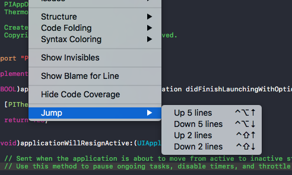

# Jump
XCode source editor extension for quick moving cursor between lines.

Allows to move two or five lines up/down.

## Requirements
Xcode 8 and Swift 3.0

## Installation
Source editor extensions are still in beta at the time of writing so there is no easy way to run them.

In general running extension requires next steps:
- Check that you have Xcode 8 installed
- Open project and run extension scheme
- In dialog appeared choose Xcode as a target app. Double check that it's also Xcode 8
- You'll see a new instance of Xcode with gray icon meaning its a separate instance for testing extension
- Extension is installed in both instances and you can use it

Remember that after stopping target Xcode instance (one with gray icon) extension will go away.

## Troubleshooting
- If you dont see `Jump` menu item under `Editor` menu try run `sudo /usr/libexec/xpccachectl` and restart
- Also remember that signing should be enabled on both application and extension targets

## Using extension
This is just proof of concept and maybe a starting template for you to play with extensions.

Extensions are not ready for everyday use due to complicated installation process and lack of possibility to persist them between Xcode runs.

## License
`Jump` is available under the MIT license. See the [LICENSE](LICENSE) file for more info.
